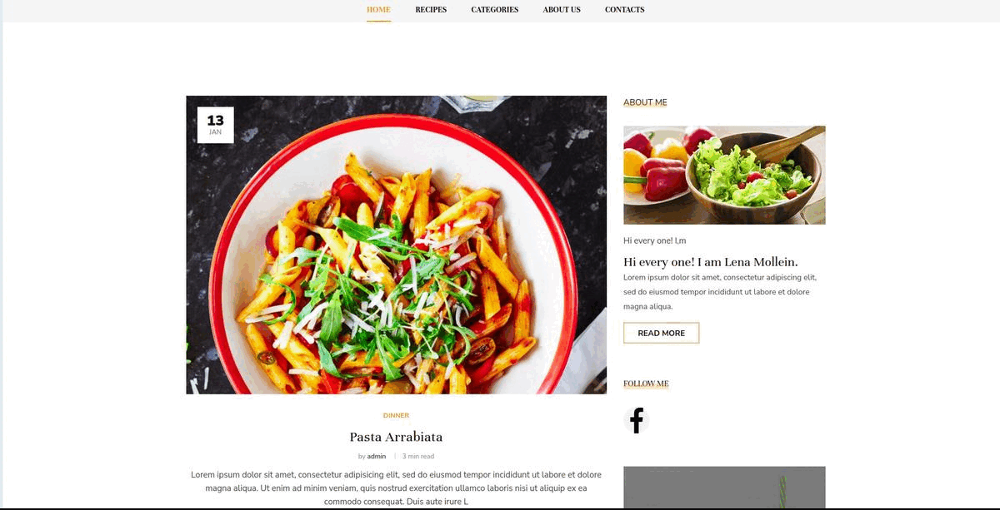

# food_project


# Yoga


This food blog application allows you to create your own post with receipes. You can also complete the form for contacting admin. 
You can choose any categories of receipes, and read posts from the blog.
You can submit your own comment on any post you want, and you will see your comment right away. If you click on the Facebook link it will redirect you to the Facebook website.


## Demo

Insert gif or link to demo



## Installation

Install my-project with npm

```bash
  git clone https://github.com/AnastasiiaK120/food_project.git

  cd my-project

  python -m venv venv

  pip install -r requirements.txt

  python manage.py migrate

  python manage.py createsuperuser

  python manage.py runserver


